<style>
body {
text-align: justify
}
</style>

```{css, echo=FALSE}
.row {
  display: flex;
}

.column {
  flex: 50%;
}
```


# Introduction

**piTracer** is a web application that enables the querying of distant functional relationships between molecules and creates interactive visualizations of the molecular paths (i.e. **traces**) between start and end node pairs. It can also predict likely gene combination candidates from differential metabolomics experiments.

----

# Cascade reconstruction

## Overview

:::: {style="display: grid; grid-template-columns: 1fr 1fr; grid-column-gap: 15px;"}

::: {}
  To create traces, add gene symbols (HGNC) or metabolite identifiers to the 
  start nodes and end nodes text fields. Any number of genes or metabolites can 
  be entered, one per line. For metabolites, the application recognizes 
  __Recon__,  __KEGG__, __HMDB__, and __PubChem ID__.
 
  To trace between all pairs of start and end nodes, check the 
  [All vs. all](#all_vs_all) checkbox. Unchecking this option will create traces 
  between pairs of start and end nodes (first vs. first, second vs. second, and so on). 
  Note: When this option is unchecked, the
  number of start and end nodes must be the same.
 
  It is also possible to search for genes or metabolites in the search bar above 
  the text fields. When the selection is done, pressing one of the buttons to 
  the right will add them to either start or end nodes. The compartment menu controls the
  cellular compartment in which the search will be performed.
 
  Additionally, there is the option to upload a list of gene/metabolite 
  identifiers as a file: 
  [File upload options](#user_file).
 
  Clicking the _Trace_ button at the bottom will start trace calculation.
  
  piTracer can create traces from genes to genes, genes to metabolites and from
  metabolites to metabolites, however traces from metabolites to genes are not 
  possible.
:::

::: {}
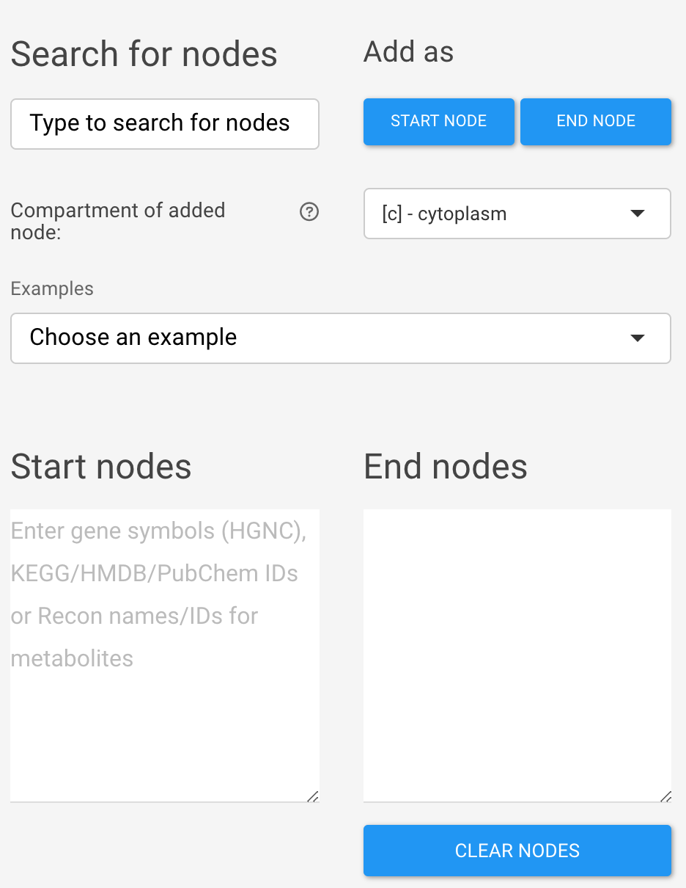
:::

::::


## File upload {#user_file}

:::: {style="display: grid; grid-template-columns: 1fr 1fr; grid-column-gap: 15px;"}

::: {}
piTracer accepts __.csv__, __.xls__, and __.xlsx__ files. The files must contain 
a first column that enumerates start nodes, and a second column that lists end 
nodes. Accepted metabolite identifiers are __KEGG__, __HMDB__ and 
__PubChem ID__. Note that these metabolite identifiers will automatically be 
converted to Recon identifiers once uploaded. HGNC gene symbols are accepted for
genes.
:::

::: {}
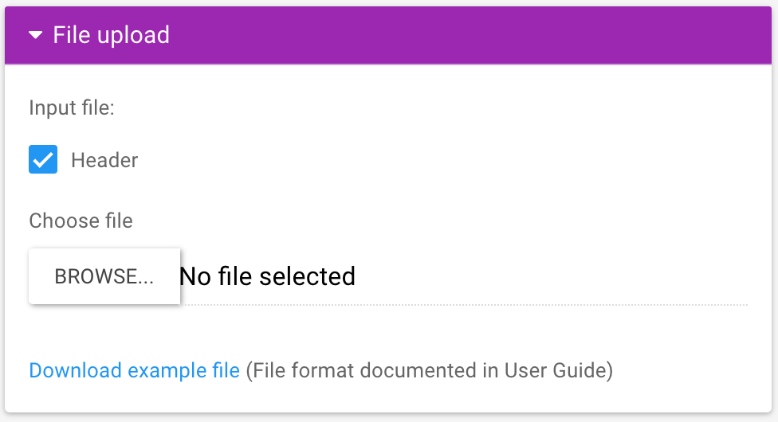
:::

::::


## Tracing options

:::: {style="display: grid; grid-template-columns: 1fr 1fr; grid-column-gap: 15px;"}

::: {}


### All vs. all {#all_vs_all}
If this option is unchecked, the app will trace in pairwise mode, i.e., the first start node vs. the first end note,
the second start node vs. the second and note, and so on. If the option is checked,
all start nodes will be traced vs. all end notes. 
When searching pairwise, the same number of both start and end nodes
have to be provided.

### Cluster paths
Checking this option will enable groups of similar traces to be visualized in 
the network visualization. Clusters represent traces that may represent 
redundant biological pathways. 

### k
_k_ denotes the number of shortest paths to be enumerated between each start and end node pair.


### Compartment location

If metabolites are specified without compartment locations such as [c], [e], etc., this field determines what default compartment will be used. If the metabolite does not exist in this compartment, a standard priority order will be followed.
:::

::: {}
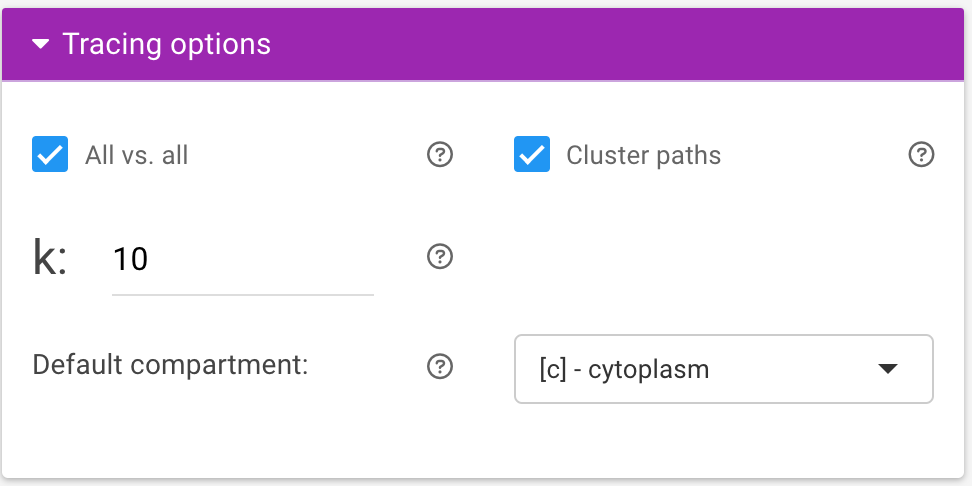
:::

::::


## Blacklist

:::: {style="display: grid; grid-template-columns: 1fr 1fr; grid-column-gap: 15px;"}

::: {}
Once traces have been generated, it is possible to blacklist (exclude) certain nodes from
the trace and recalculate the trace. There are three ways to add molecules to 
the blacklist:

1. __Add molecules manually__  
This search bar lists all molecules and their interactions that can be found in
the current visualization. 

2. __Add molecules from the interactive network view__   
Select a node from within the visualization by clicking on it. Then click on 
_Blacklist selected node_.

3. __Upload your own blacklist__  
There is also an option to upload pre-made blacklists. This blacklist can be 
applied to the _current_ visualization or to _all_ traces.

Once the blacklist is finalized, clicking _Re-Trace_ will apply the blacklist to
the current trace and will calculate a new trace without the specified nodes. 
Clicking on the _Download blacklist_ button will save the blacklist for future 
use.
:::

::: {}
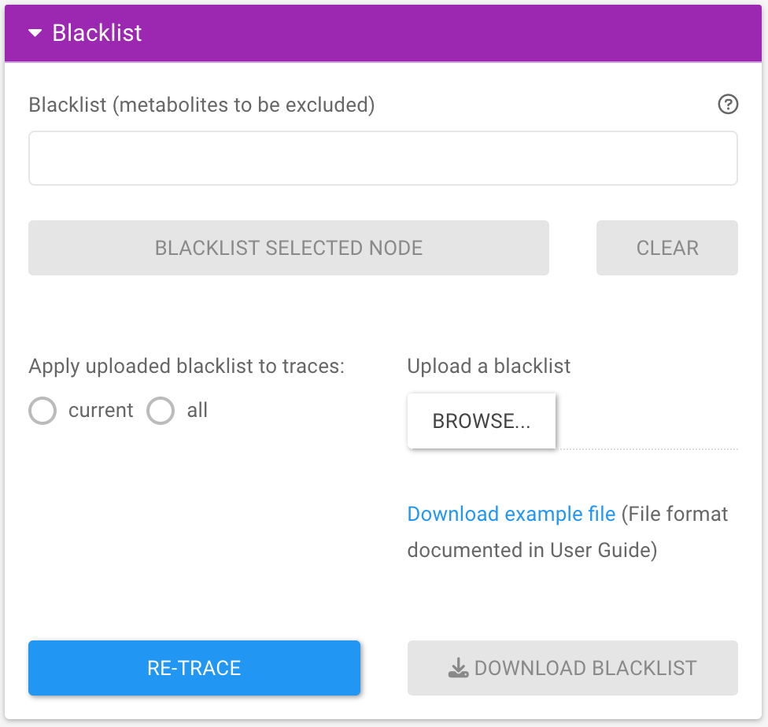
:::

::::


## Trace selection tab

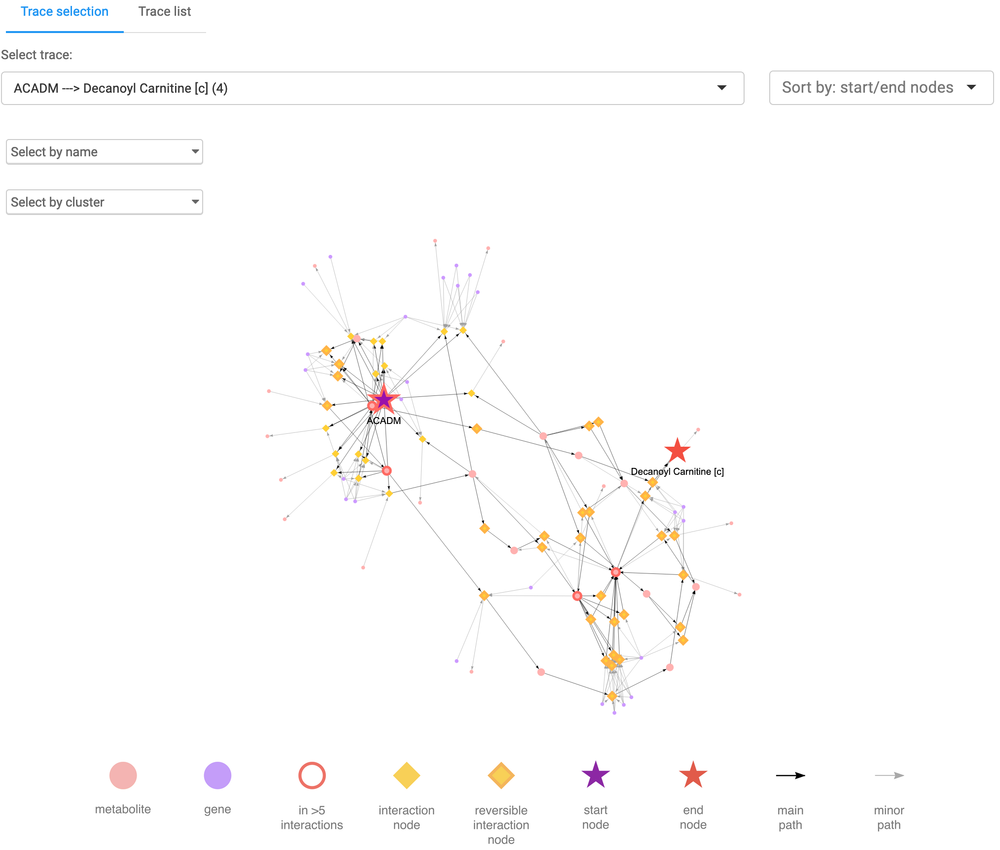

:::: {style="display: grid; grid-template-columns: 1fr 1fr; grid-column-gap: 15px;"}

::: {}
After calculation, traces are visualized as an interactive graph. Nodes can be selected and
moved around, and hovering over nodes shows their reference source. Nodes can 
also be selected by name and highlighted by [cluster](#cluster paths) using the 
dropdown found in the upper left corner of the visualization.
:::

::: {}
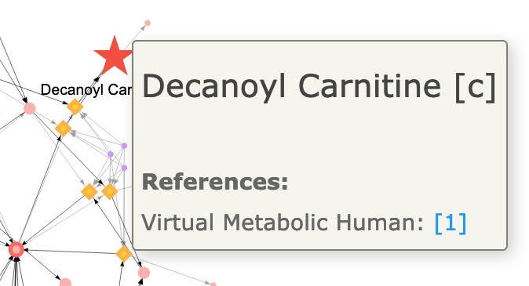
:::

::::

## The trace list tab

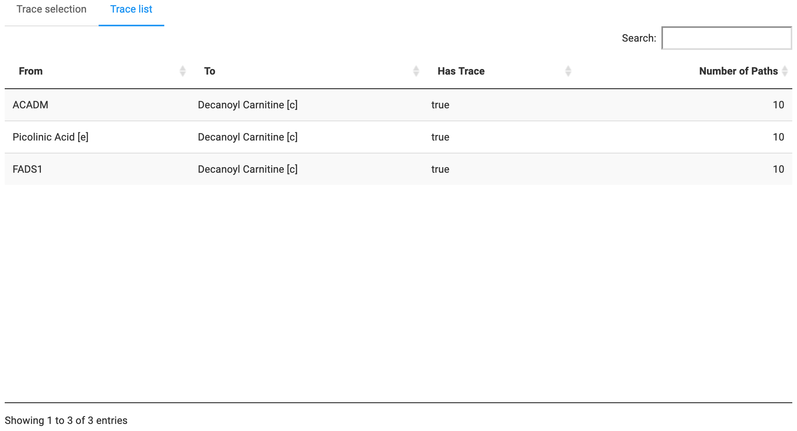

This table summarizes if and how many traces were found between start and end 
node combinations.


## The ID map tab

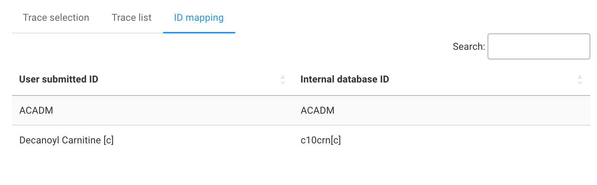

If __KEGG__, __HMDB__, or __PubChem ID__ metabolite identifiers were supplied, 
piTracer automatically converts these to Recon identifiers prior to tracing. The 
identifiers' mapping can be found here.


## Download results
piTracer’s results can be downloaded in a **.zip** file which contains the 
following objects:

* An **.html** file with all interactive graphs
* An **.xlsx** file giving an overview between which molecules traces were 
found, their shortest traces, their lengths, and which molecules make up the 
traces
* If metabolites were provided as Recon, KEGG, HMDB or PubChem ID, another 
**.xlsx** file listing the original input IDs and their corresponding metabolite
names
* A **.graphml** file for each graph

The .graphml files were tested in **Cytoscape v.3.8.2** only and do not 
automatically use piTracer’s color and shape scheme. They have to be manually 
set from within Cytoscape. The necessary parameters are however included in the 
files.


----

# Gene target identification

## Enter metabolites

:::: {style="display: grid; grid-template-columns: 1fr 1fr; grid-column-gap: 15px;"}

::: {}
To score genes for targetability, add metabolites (optionally as **Recon**, 
**KEGG**, **HMDB** or **PubChem ID**) and their level of statistical 
significance to the table. This can be done in one of two ways:

1. by double-clicking cells on the app and manually adding these, or
2. by uploading a file containing the relevant information (see below for the 
file format).

The buttons below the table can help to add/delete rows, or clear the current 
table entirely.

Compartment locations can be  explicitly given, or are automatically assigned to each metabolite, in the
following priority order: extracellular (marked with *[e]* after the metabolite 
name), cytoplasm (*[c]*), mitochondrion (*[m]*), endoplasmic reticulum (*[r]*), 
nucleus (*[n]*), golgi apparatus (*[g]*), peroxisome (*[x]*), lysosome (*[l]*).
:::

::: {}
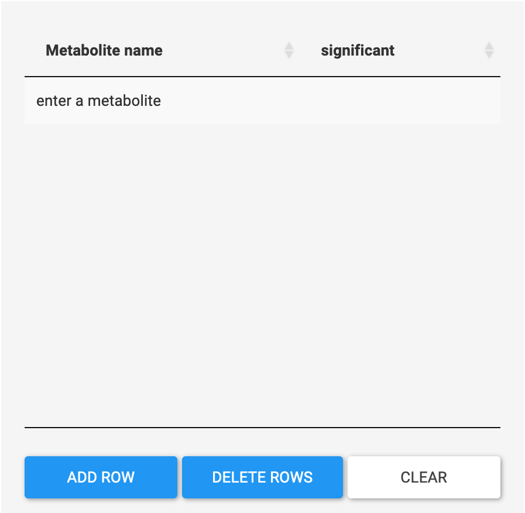
:::

::::

## User file upload

piTracer accepts **.csv**, **.xls** and **.xlsx** files. The files must contain 
a first column that lists metabolites, and a second column that indicates 
their level of statistical significance. Metabolites are recognized by their 
name or by their **Recon**, **KEGG**, **HMDB** or **PubChem ID**. The 
significance can be given in the form of "t" or "true" and "f" or "false" 
respectively (case-insensitive).


##  Results

### The Main results tab
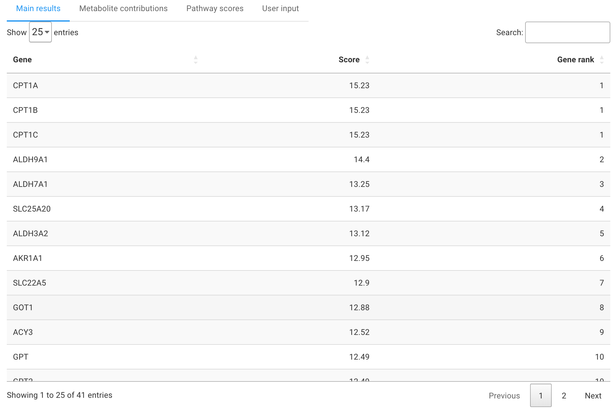 

Main results are given in three columns: The gene, its 
corresponding target score, and its rank. Briefly, the target score is calculated for each gene 
based on the proximity of that gene to significant metabolites, down-weighed by 
the number of other enzymes it interacts with to reach these metabolites. (see original paper)


### Metabolite contributions
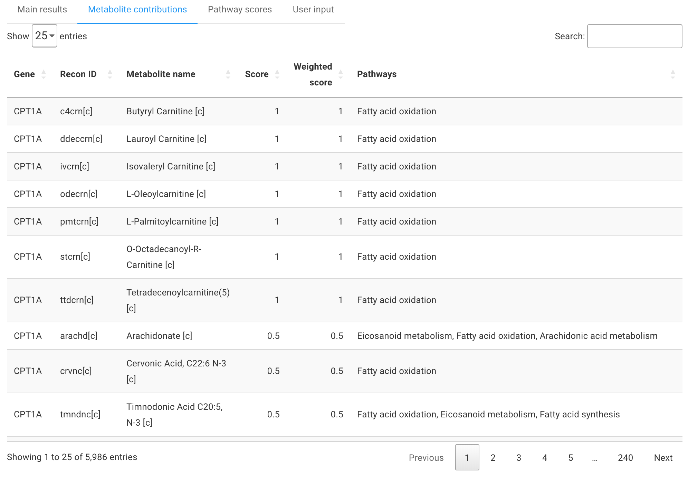 

This table shows which genes affect which metabolites and in which pathways the 
latter are involved.


### Pathway scores
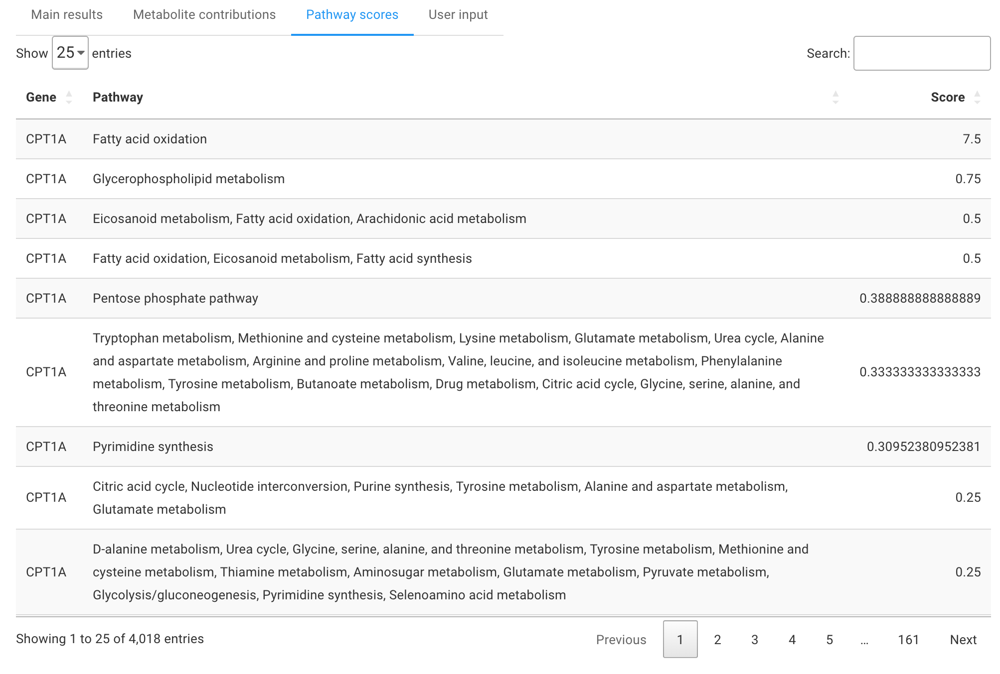

This section shows the aggregated scores that each pathway contributed; i.e., the sum of contributions of each metabolite in the pathway.

###  User input
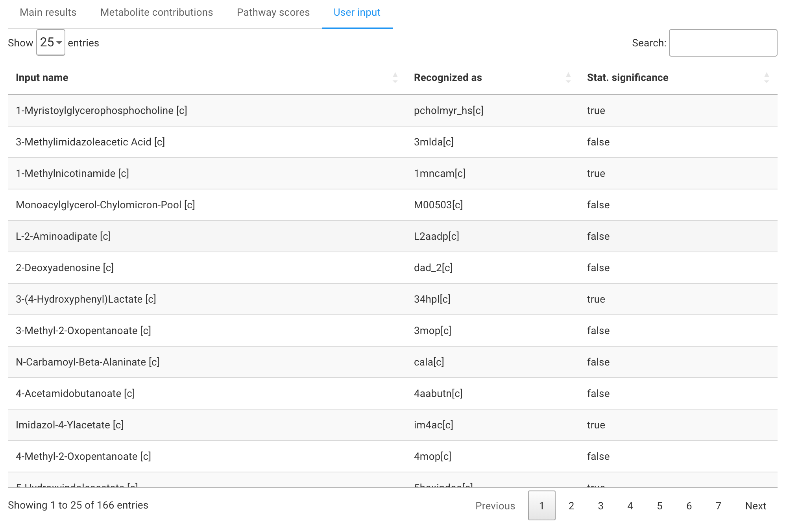

piTracer offers a table that directly shows what input was given and which database entry the input was recognized as.


<div class="tocify-extend-page" data-unique="tocify-extend-page" style="height: 0;"></div>
